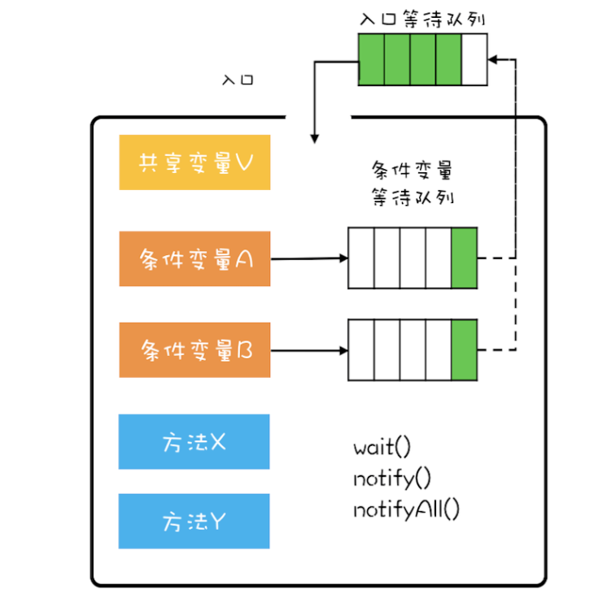

#### 管程
        在了解Java中的锁之前，先来了解下管程，因为java中的锁就是基于管程实现的。那么管程是什么呢？就是管理共享变量和对共享变量操作的过程（也可以认为是监视器），让他们支持并发。
    在Java中就是指管理一个类的成员变量和成员方法，让这个类是线程安全的。那么，管程到底是如何管理的呢？

    首先来看下管程的几种模型：
        1.Hasen模型
        2.Hoare模型
        3.MESA模型
    Java管程实现就是参考的MESA模型。
    
        在并发领域，一个是互斥，就是同一时刻只允许一个线程对共享变量访问。另外一个就是同步，就是线程间的同步与协作。来看下管程是如何解决这两个问题的。
    互斥解决：将共享变量及对共享变量的操作封装起来，对外提供统一的访问方法，这个统一的方式实现了互斥性，保证同一时间只能允许一个线程访问
    同步解决：（参考下图）管程模型中，共享变量和对共享变量操作的方法都是封装起来的，下图最外框表示封装的意思，只有一个入口，并且入口旁有一个队列，叫做等待队列。
    当多个线程准备进入管程内部时，只允许一个线程进入，其它线程则在入口等待队列等待。
        管程还引入了条件变量的概念，并且每个条件变量都对应一个等待队列。如下图条件变量A和B对应的等待队列
    

    条件变量与等待队列的作用是什么呢？其实就是用来解决线程同步的。已上图为列：
    将其比作队列（主要为了说明互斥作用，管程同一时刻只允许一个线程操作），条件变量A表示"队列不为空"，条件变量B表示"队列不满"，此时，如下步骤描述：
        1.线程T1执行出队方法，对应出队有一个前提条件，就是队列不能为空，也就对应条件变量A，此时如果队列为空，就是不满足条件，则线程T1进入变量A对应的等待队列（此时另外一个线程是可以进入管程的），
            如果满足则执行出队，然后唤醒等待入队线程
        2.线程T2执行入队方法，如果"队列不满"条件满足，则入队，并且这个时候条件变量A满足了，需要通知线程A，当A收到通知后，会从条件变量等待队列出来，但是并不是立即执行，而是到入口的等待队列。因为这个时候
            入口等待队列的条件可能不满足条件，所以需要重新到入口队列等待。
        3.JUC包下的工具锁，可以定义多个条件变量，更加灵活，而jdk内置锁synchronized，只有一个条件变量，并且是在编译期自动生成加锁和解锁代码，而JUC.Lock需要显示加锁解锁
    
        上面描述的进入条件变量等待队列，对应的就是wait()，而通知就是notify和notifyAll()；以上面的描述，如果用对象A表示"队列不空"这个条件，线程T1发现条件不满足，调用A.wait()，线程T2执行完后通过A.notify()
    唤醒线程T1，也可以使用notifyAll()。参考列支**LockBlockingQueueDemo.java**
        notify()唤醒一个线程，notifyAll()唤醒所有等待线程，通常情况下，直接使用后者即可，但是如果满足以下条件，可以使用notify()
        1.所有等待线程拥有相同等待条件
        2.所有等待线程被唤醒后，执行相同操作
        3.只需唤醒一个线程
        
    **注意：在调用wait()时，需要使用while()，这也是MESA管程模型的特性
    
    最后，在这里说下三种模型的一个核心区别，条件满足时如何通知相关线程
        1.Hasen模型
            notify()放到代码最后，这样T2通知完T1之后，T2结束，T1执行，这样保证同一时刻只有一个线程执行
        2.Hoare模型
            T2通知完T1，T2阻塞，T1马上执行，T1执行完，唤醒T2，也可以保证同一时间只有一个线程执行，但是比上面模型多了次唤醒
        3.MESA模型
            T2通知完T1，T2继续运行，T1并不会马上执行，而是由条件变量队列进入入口等待队列，这么做好处就是notify()无需放到代码最后，但也有坏处，就是T1在此执行时，可能曾经满足的条件，现在不满足了，所有需要循环检查条件变量
    
#### 内置锁 VS JUC.Lock
    jdk内置锁synchronized也是管程的一种实现，只不过条件变量只有一个，并且加锁解锁都是由JVM提供的，这个时候可能有个疑问，既然jdk已经提供了管程的实现，为什么JUC还要重复造轮子呢？首先可能想到的原因就是性能
问题了，在jdk1.6之前，性能确实是synchronized的一个问题，但是在jdk1.6之后，已经对synchronized做了优化，可以看到，性能并不是再造工具的理由，其实，ReentrantLock对比synchronized有以下优点
    1.可响应中断
    2.支持超时，可尝试加锁，超时未获得锁之后去做其它事情
    3.多条件变量，更加灵活
    4.非阻塞获取锁